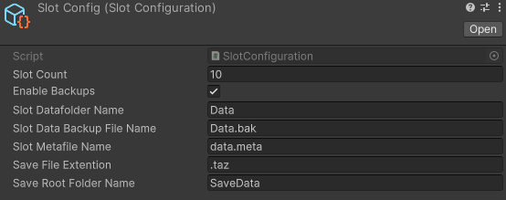

<h1 align="center">SaveSystem</h1>
<p align="center">
<a href="https://openupm.com/packages/com.studio23.ss2.savesystem/"></a>
</p>

# Save System for Unity

Save System is a framework to manage local and cloud saves. It provides simple interface to save files and configure cloud saves for Steam or Xbox and other platforms via extensions.


## Table of Contents

1. [Installation](#installation)
	- [Git URL](#git-url)
	- [Package Manager](#package-manager)
2. [Getting Started](#getting-started)
   - [Setup](#setup)
   - [Creating Save Slots](#creating-save-slots)
3. [Saving and Loading Data](#saving-and-loading-data)
   - [Save Data](#saving-data)
   - [Load Data](#loading-data)
4. [Managing Save Slots](#managing-save-slots)
   - [Selecting a Slot](#selecting-a-slot)
   - [Clearing Slots](#clearing-slots)
5. [Advance Features](#advance-features)
   - [Debug Tools](#debug-tools)
   - [Slot Configuration](#slot-configuration)
   - [Archiver](#archiver)
   - [Encryptors](#encryptors)
   - [Cloud Save](#cloud-save)

## Installation


###  Git URL
You can also use the "Install from Git URL" option from Unity Package Manager to install the package.
```
https://github.com/Studio-23-xyz/SaveSystem.git#upm
```

### Package Manager

1. open Edit/Project Settings/Package Manager
2. add a new Scoped Registry (or edit the existing OpenUPM entry)
```
Name 	package.openupm.com
URL 	 https://package.openupm.com
Scope(s) com.cysharp.unitask
			com.studio23.ss2.cloudsave
			com.studio23.ss2.savesystem
```
3. click Save or Apply
4. open Window/Package Manager
5. click +
6. select Add package by name... or Add package from git URL...
7. paste com.studio23.ss2.savesystem into name
8. click Add


## Getting Started

### Setup

From Top tool bar Studio-23->Save System->Installer

### Initialize

Before you do anything with savesystem. You must call the initialization method. When should you call this method? Each platform provider should have it's own AuthSystem. Once AuthSystem has done initializing, Save System should attempt to initialize.

You can  call Initialize method via script like this

```csharp
using Studio23.SS2.SaveSystem.Core;
using Cysharp.Threading.Tasks;

public class YourGameManager : MonoBehaviour
{
    private async void Start()
    {
        await SaveSystem.Instance.Initialize();
    }
}
```

Ideally this method should be called from an event after the AuthSystem has been initialized


## Saving and Loading Data

### Saving Data

To save data using the SaveSystem library, you need to implement `ISavable` interface for each monobehaviour that you wish to save. You can find example in the samples folder.

This is how you can call the save method. By default it will save all ISavable items.

```Csharp
await SaveSystem.Instance.Save();

```

If a true is passed, then it will only save those ISavables that are dirty.

```Csharp
await SaveSystem.Instance.Save(true);
```
`Note: You must implement IsDirty property for ISavables`

### Loading Data

Loading data is as simple as calling the LoadMethod.

```Csharp
await SaveSystem.Instance.LoadData();
```


## Managing Save Slots

### Selecting a Slot

You can switch between save slots by using the `SelectSlot` method:

```csharp
using Studio23.SS2.SaveSystem.Core;

public class YourGameManager : MonoBehaviour
{
    private void SwitchSaveSlot(int slotIndex)
    {
    	//Selects the slot at index.
        SaveSystem.Instance.SelectSlot(slotIndex);
        
        //Selects the Last Selected slot. Saves the selected index in playerprefs.
        SaveSystem.Instance.SelectLastSelectedSlot();
    }
}
```
`Slot index starts from 0`


### Clearing Slots

To clear all save slots, you can use these methods

```csharp
using Studio23.SS2.SaveSystem.Core;
using Cysharp.Threading.Tasks;

public class YourGameManager : MonoBehaviour
{
    private async void ClearAllSlots()
    {
        // Clear all save slots
        await SaveSystem.Instance.ClearAllSlots();
        
        // Clear Selected Slot only
        await SaveSystem.Instance.ClearSelectedSlot();
        
    }
}
```

# Advance Features

## Debug Tools


A set if tools to make developers life easy. Run the public methods from editor directly.

## Slot Configuration
You can change how the files are saved or how many slots will be there.


- `Slot Count` : The number of slots that will be allocated. *(Basically number of folders)*
- `Enable Backups` : When enabled, Save system will create backups of selected slot if Loading is successful. If loading is sucessful, The integrity is validated.By default this is enabled
- `Slot Data Folder Name` : Name of the folder that keeps the saved data files.
- `Backup File Name` : Name of the backup file. If created.
- `Metafile Name` : Name of the meta file.
- `Save File Extention` : extention for savefiles.
- `Root Folder Name` : Name of the root folder of SaveSystem.

**Changing anything from here is not recommended after your game has been shipped as it will impact how the files and folders are managed and loaded**


## Archiver
SaveSystem comes with `ZipUtilityArchiver`.This is used to create backups.You can create your own Encryptor by inheriting the `ArchiverBase` Class.

**Valid Archiver is required for creating backup**

## Encryptors
If you assign an encryptor scriptable object to the savesystem monobehaviour it will encrypt before saving files and decrypt before loading files. SaveSystem comes with `AESEncryptor`. You can create your own Encryptor by inheriting the `EncryptorBase` Class.

**If you don't wish to use any encryption simply remove the scriptable object from the monobehaviour.**

## Cloud Save
Cloud save functionalities require installing platform dependent packages such as Steam & XBOX. For development the SaveSystem Package comes with DummyProviders. You can later swap out with appropiate packages or implement your own.

The way it works is on successful save the system sends all the saved files to the assigned provider to upload to the cloud.

Given that a valid provider is assigned you can utilize the following cloud methods.

```csharp
// Sync with the cloud data
await SaveSystem.Instance.SyncSelectedSlotData();

// Attempts to restore local backup. If fails attempts to restore from cloud. if still fails it throws exception. This shouldn't happen.
await SaveSystem.Instance.RestoreBackup();
```

> That's it! You now have the basic information you need to use the **SaveSystem** library in your Unity project. Explore the library's features and customize it according to your game's needs.

- - - -

## Other Links

[Scripting API Documentation](https://studio-23-xyz.github.io/SaveSystem/api/index.html)
[OpenUPM Page](https://openupm.com/packages/com.studio23.ss2.savesystem/)

